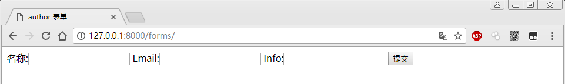
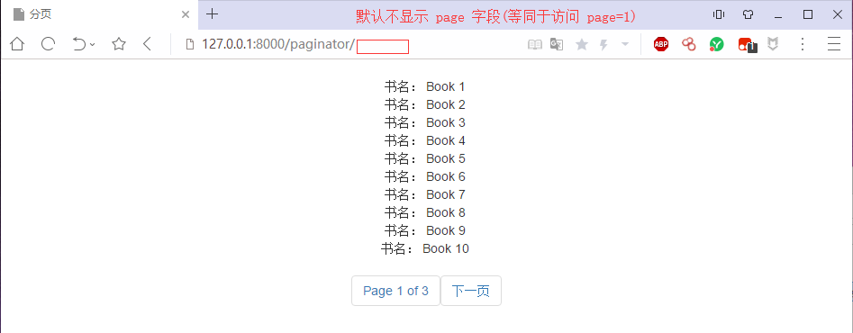
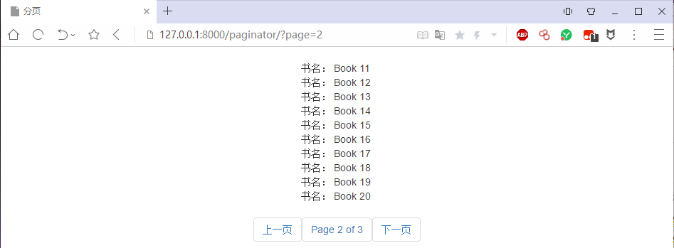

个人 Django 学习笔记系列文章中的 demo 示例代码。

> 准备工作
- 使用版本:  
- Django 版本: 2.0.x
- 需要安装 Python IDE 工具：**Pycharm**
- 安装 Mysql 数据库，我这里采用集成环境软件 **WampServer**
- 如果你使用 Python 3.0 版本，需要使用 pip 安装依赖库 **mysqlclient** 
- 在`settings.py` 中的 `DATABASES` 选项，根据你使用 mysql 的账号、密码以及数据库的名称，重新配置。以下代码是我使用的默认配置。
```python
# Database
# https://docs.djangoproject.com/en/2.0/ref/settings/#databases

DATABASES = {
    'default': {
        # 'ENGINE': 'django.db.backends.sqlite3',
        # 'NAME': os.path.join(BASE_DIR, 'db.sqlite3'),
        'ENGINE': 'django.db.backends.mysql',
        'NAME': 'django',
        'HOST': '127.0.0.1',
        'PORT': '3306',
        'USER': 'root',
        'PASSWORD': '123456',
    }
}
```

 
> 以下是各个 App 对应的内容说明：
### **demo** 
- 这是 Django 中`Model(模型)` 用法的示例代码。
- 详细用法可以阅读 [Django 学习笔记之模型（上）](https://mp.weixin.qq.com/s/Zdd7gT0T7RWee86P2S6IXA)
- 测试地址：因为本 App 主要讲解 model，讲解 Django 如何与数据库打交道。所以没有 url 访问地址。

### **demo_form**
- 这是 Django 中`Form(表单)` 用法的示例代码。
- 详细用法可以阅读 [Django 学习笔记之表单](https://mp.weixin.qq.com/s/JgraaUPnzddOJ0QHzqAUwA)
- 测试体验 Form 用法的本地地址：[http://127.0.0.1:8000/forms/](http://127.0.0.1:8000/forms/)
- 效果预览


### **demo_paginator**
- 这是 Django 中`Paginator(分页功能)` 用法的示例代码。
- 测试体验 Form 用法的本地地址：[http://127.0.0.1:8000/paginator/](http://127.0.0.1:8000/forms/)
- 效果预览


